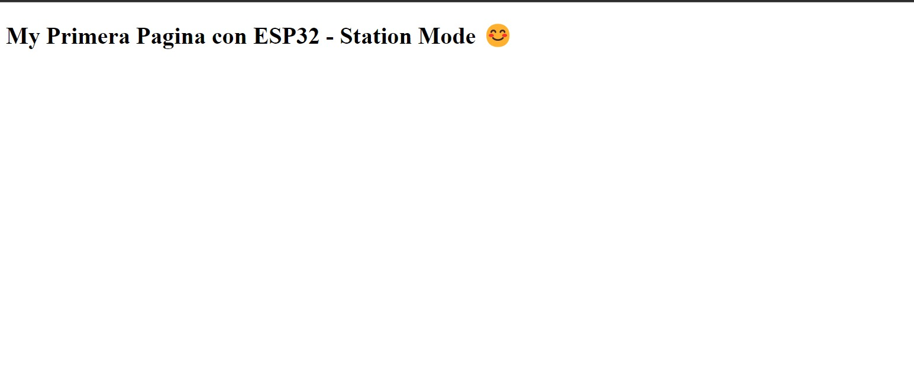

## Practica 4 Parte 1
***Raul Gonzalez / Sofia Valero***
## Codigo:

```
#include <WiFi.h>
#include <WebServer.h>
// SSID & Password
const char* ssid = "DESKTOP-QKE03VD 1063"; // Enter your SSID here
const char* password = "=16321Fj"; //Enter your Password here
WebServer server(80); // Object of WebServer(HTTP port, 80 is defult)

void handle_root();

void setup() {
Serial.begin(115200);
Serial.println("Try Connecting to ");
Serial.println(ssid);
// Connect to your wi-fi modem
WiFi.begin(ssid, password);
// Check wi-fi is connected to wi-fi network
while (WiFi.status() != WL_CONNECTED) {
delay(1000);
Serial.print(".");
}
Serial.println("");
Serial.println("WiFi connected successfully");
Serial.print("Got IP: ");
Serial.println(WiFi.localIP()); //Show ESP32 IP on serial
server.on("/", handle_root);
server.begin();
Serial.println("HTTP server started");
delay(100);
}
void loop() {
server.handleClient();
}
// HTML & CSS contents which display on web server
String HTML = "<!DOCTYPE html>\
<html>\
<body>\
<h1>My Primera Pagina con ESP32 - Station Mode &#128522;</h1>\
</body>\
</html>";
// Handle root url (/)
void handle_root() {
server.send(200, "text/html", HTML);
}

```
### Salida:

En este codigo vamos a poder crear nuestra primera pagina web con el ESP-32 utilizando su conexion WIFI.
Es una pagina web simple pero sirve como demostracion de lo que se puede hacer con un codigo basico.



## Aclaraciones del Codigo:
```
// SSID & Password
const char* ssid = "DESKTOP-QKE03VD 1063"; // Enter your SSID here
const char* password = "=16321Fj"; //Enter your Password here
WebServer server(80); // Object of WebServer(HTTP port, 80 is defult)

```
Con esta parte del codigo conectamos la placa esp 32 al emisor wifi, en este caso mi ordenador, para que sea capaz de generar la pagina web.