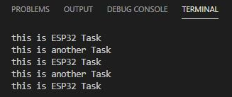

# PRACTICA 4: SISTEMAS OPERATIVOS EN TIEMPO REAL

## CODIGO
El objetivo de esta práctica es entender la utilidad de las tareas y su implementación y funcionamiento.

Básicamente, las tareas son procesos que se ejecutan fuera del proceso principal (loop) cuando el procesador está libre. Esto ocurre, por ejemplo, cuando implementamos un "delay" de un cierto tiempo en el programa principal. Es en este tiempo cuando se ejecutaría la posible tarea o tareas que hayamos creado.

```cpp

#include <Arduino.h>

void anotherTask ( void * parameter); 

void setup(){
    Serial.begin(112500);
    xTaskCreate( anotherTask, "another Task", 10000, NULL, 1, NULL); 
    }

void loop(){
    Serial.println("this is ESP32 Task");
    delay(1000);
    }

void anotherTask( void * parameter ){
    for(;;){
        Serial.println("this is another Task");
        delay(1000);
        }
    vTaskDelete( NULL );
}

```

## FUNCIONAMIENTO

El codigo principal nos permite ver por pantalla cuando se esta ejecutando el proceso principal. 

En el setup creamos la tarea utilizando la función xTaskCreate():


```cpp
void setup(){
Serial.begin(112500);
xTaskCreate(anotherTask, "another Task", 10000, NULL, 1, NULL);
}
```
Los parámetros que se introducen en el setupson los siguientes:

anotherTask es la función que ejecuta la tarea.

"anotherTask": es el nombre que le damos a la tarea.

10000: es el tamaño de la tarea ("Stack size").

NULL: es el parámetro de la tarea (en este caso no requiere ninguno).

1: es la prioridad de la tarea. Cuanto mayor sea el número, mayor será la prioridad. Esto es importante en caso de que el programa tenga más de una tarea para ejecutar. Se ejecutarán primero las tareas con mayor prioridad.

NULL: es el identificador de la tarea.

```cpp
void loop(){
    Serial.println("this is ESP32 Task");
    delay(1000);
    }
```


En el loop lo que hacemos es mostrar por pantalla "this is ESP32 task" seguido de un retardo de 1000ms. En este delay se ejecutará la tarea creada. 

## DEFINICIÓN ANOTHER TASK
```cpp
void anotherTask( void * parameter )
{
    for(;;){
        Serial.println("this is another Task");
        delay(1000);
        }
    vTaskDelete( NULL );
}
```

Esta tarea implementa un bulce infinito para que el proceso se esté ejecutando en todo momento. Añadimos la función vTaskDelete() con el proposito de terminar la tarea pero vemos que tiene NULL como parámetros, por mucho que no llegue a ejecutarse hay que añadirla para que el programa funcione correctamente. 

Mientras se ejecuta el bucle se muestra por el terminal "this is another task" y le añade un delay de 1000ms. 

## RESULTADO TERMINAL

El programa primero muestra por el terminal: "this is ESP32 Task". Por lo tanto, se ejecuta el proceso principal (loop).

Luego, mientras se aplica el primer delay (el del loop), se ejecuta la tarea, ya que muestra por el terminal: "this is another Task".

Una vez finalizado el delay del loop, volvemos a ver por el terminal "this is ESP32 Task". Se ha vuelto a ejecutar el programa principal.

A continuación, habrá finalizado el delay de la tarea y se mostrará nuevamente "this is another Task". Se ha vuelto a ejecutar la tarea.

Y así succesivamente. 


